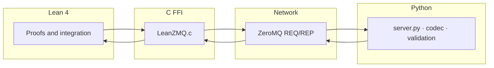

<h1 align="center">lean-python-bridge</h1>

<p align="center">
  <strong>Formal methods meet a numerical service</strong><br/>
  Lean&nbsp;4 · ZeroMQ · Python
</p>

<p align="center">
  <a href="docs/quickstart.md">Quickstart</a>
  &nbsp;·&nbsp;
  <a href="docs/transport-troubleshooting.md">Transport &amp; troubleshooting</a>
  &nbsp;·&nbsp;
  <a href="LICENSE">MIT License</a>
</p>

---

This repository is a **Lean&nbsp;4 Lake package** and a **Python REQ/REP server** wired together over **ZeroMQ**: Lean can call into C FFI (`libzmq`), exchange JSON with Python, and ship proofs alongside integration code. Application logic on the Python side lives in `python/src/`; formal artifacts live under `lean/`.

The Lake library is published as **`LeanPythonBridge`** (see `lakefile.lean`). Typical modules include `FFI.ZMQ`, `MathDefs`, `MatrixProps`, `PythonIntegration`, `MLProofs`, `Tests`, and `ExampleProof`.



---

## Contents

- [Contents](#contents)
- [Get started in two minutes](#get-started-in-two-minutes)
- [What you need to build Lean](#what-you-need-to-build-lean)
- [Imports and module layout](#imports-and-module-layout)
- [Repository tree](#repository-tree)
- [Python dependencies \& lockfiles](#python-dependencies--lockfiles)
- [Run the server](#run-the-server)
- [Tests](#tests)
- [Docker \& Compose](#docker--compose)
- [CI, security, contributing](#ci-security-contributing)

---

## Get started in two minutes

| Step | Command |
|------|---------|
| Build Lean | `lake build` |
| Runtime Python deps | `pip install --require-hashes -r python/requirements-runtime.lock.txt` |
| Dev tooling (lint, types, …) | `pip install --require-hashes -r python/requirements-dev.lock.txt` |

Full local install (from the repo root):

```bash
python -m pip install --upgrade pip
pip install --require-hashes -r python/requirements-runtime.lock.txt
pip install --require-hashes -r python/requirements-dev.lock.txt
pip install -r bench/requirements.txt
lake build
```

Smoke checks:

```bash
lake env lean lean/ExampleProof.lean
PYTHONPATH=python/src python -c "import validation; print('ok')"
```

---

## What you need to build Lean

`lake build` compiles `lean/FFI/LeanZMQ.c` and links against **libzmq**. You need:

- a **C toolchain** (`cc` / `gcc`),
- **libzmq** development headers and libraries (e.g. `libzmq3-dev` on Debian/Ubuntu),
- **libgmp** development files.

The [Dockerfile](Dockerfile) uses Ubuntu&nbsp;22.04 with `build-essential` and `libzmq3-dev`—that is the well-trodden path. On Windows, prefer **WSL** or **Docker** for a frictionless build; native MSVC/MinGW setups are possible but not what CI exercises.

---

## Imports and module layout

- **Inside this repo:** after `lake build`, import by module name, e.g. `import MathDefs`, `import FFI.ZMQ`, `import PythonIntegration`. Sources sit under `lean/` (Lake `srcDir`).
- **As a dependency:** add a `require` in your `lakefile.lean` pointing at this repository and revision, then import the modules you need.
- **Python:** put `python/src` on `PYTHONPATH` (or an equivalent layout) so `validation`, `codec`, and friends resolve without editing `sys.path` in every script.

---

## Repository tree

```text
lean-python-bridge/
├── lakefile.lean              # Lake package leanPythonBridge, FFI, static lib
├── lake-manifest.json         # Lock with lakefile; commit when it changes
├── lean-toolchain             # Pin for elan / CI
├── lean/                      # Lean sources; C FFI in lean/FFI/
├── python/                    # Server, lockfiles, tests
├── bench/                     # Benchmarks; optional Lean harness in bench/lean/
├── docs/                      # Guides
├── monitoring/                # Prometheus / Grafana samples
├── scripts/                   # e.g. compile_python_locks.py
├── Dockerfile
├── docker-compose.yml
└── .github/workflows/ci.yml
```

---

## Python dependencies & lockfiles

| Role | Files |
|------|--------|
| Human-edited inputs | `python/requirements-runtime.in`, `python/requirements-dev.in` |
| Installed by CI/Docker | `python/requirements-*.lock.txt` with `pip install --require-hashes -r …` |

After changing an `.in` file, refresh the locks:

```bash
python scripts/compile_python_locks.py
```

Locks target **Linux CPython&nbsp;3.11** manylinux wheels—the same environment as CI and the container image.

---

## Run the server

```bash
cd python
python src/server.py --dev
```

By default the REP socket binds to `tcp://*:5555`. Override with `ZMQ_ENDPOINT` and related environment variables (see `python/src/server.py`). With `ENABLE_METRICS=true`, Prometheus text metrics are exposed on `METRICS_PORT` (default **8000**).

The Docker image runs `python python/src/server.py` without `--dev`; pass flags or environment variables for your environment.

---

## Tests

**Python**

```bash
cd python && pytest -q tests
```

**Lean** (aligned with CI)

```bash
lake env lean lean/MatrixProps.lean
lake env lean lean/ExampleProof.lean
lake env lean lean/MLProofs.lean
lake env lean lean/Tests.lean
```

The integration job also runs `lake env lean lean/PythonIntegration.lean` against a live server on `tcp://127.0.0.1:5555`.

---

## Docker & Compose

```bash
docker build -t lean-python-bridge .
docker run --rm -p 5555:5555 -p 8000:8000 \
  -e ENABLE_METRICS=true -e METRICS_PORT=8000 \
  lean-python-bridge
```

Compose (dev profile mounts local `python/` and `lean/`; see [docker-compose.yml](docker-compose.yml)):

```bash
docker compose --profile dev up lean-python-bridge-dev
```

---

## CI, security, contributing

**Continuous integration** — [`.github/workflows/ci.yml`](.github/workflows/ci.yml) runs policy checks on placeholders, hashed lockfiles, Python lint and tests, `lake build`, Lean entry points, optional benchmarks on default-branch pushes, an integration job (server plus `PythonIntegration.lean`), and security scans.

**Security** — On untrusted networks, consider ZeroMQ **CURVE** (`ENABLE_CURVE` and server keys). Treat external payloads as hostile: validate with `python/src/validation.py`.

**Contributing** — Small, reviewable changes; regenerate Python locks when dependencies move; run `lake build` (Linux CI or Docker) and Python tests before opening a pull request.

---

<p align="center">
  MIT License · see <a href="LICENSE">LICENSE</a>
</p>
